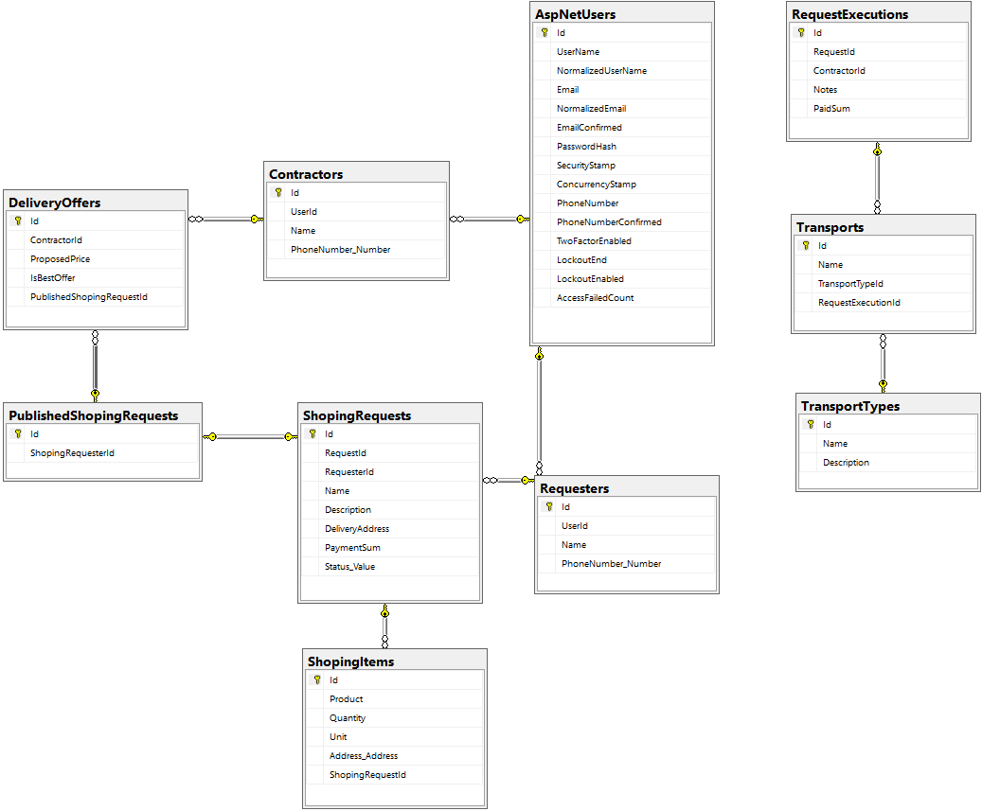
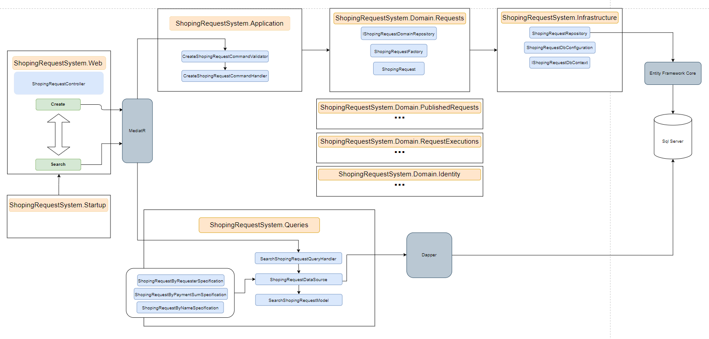

# Author
 - Todor Dimitrov
 
# Project description
 - ShopingSystem is example project for ASP.NET Core with Domain Driven Design
 - Bounded contexts - Shoping Request, Published Shoping Request and Execution of the Request
 - The solution contains a structure of 5 layers, divided into different projects
	 - Domain - This layer contains rich domain models with validation, domain events, domain exceptions, factories and domain repositories public interface
        - ShopingRequestSystem.Domain.Identity
        - ShopingRequestSystem.Domain.Requests
        - ShopingRequestSystem.Domain.PublishedRequests
        - ShopingRequestSystem.Domain.RequestExecutions
	 - Application
		- ShopingRequestSystem.Application - contains command and query handlers, validators, models, domain event handlers
		- ShopingRequestSystem.Queries - contains queries and query handlers, models and data sources
	 - Infrastructure - Database configurations, migrations and repository implementations
		- ShopingRequestSystem.Infrastructure
	 - Web - Contains controllers and middlewares
		- ShopingRequestSystem.Web 
	 - Startup - Contains web application configurations
		- ShopingRequestSystem.Startup

# Software Dependencies
 - [Docker](https://www.docker.com/get-started/)

# Run the project
	1. docker-compose build
	2. docker-compose up
 
navigate to http://localhost:5001/swagger/index.html
# Resources
- [.NET 5](https://github.com/dotnet)
- [ASP.NET Core](https://github.com/dotnet/aspnetcore)
- [Autofac](https://autofac.readthedocs.io/en/latest/)
- [MediatR](https://github.com/jbogard/MediatR)
- [Automapper](https://github.com/AutoMapper/AutoMapper)
- [Entity Framework Core](https://docs.microsoft.com/en-us/ef/core/)
- [Microsoft SQL Server](https://www.microsoft.com/en-us/sql-server/sql-server-downloads)
- [JWT](https://jwt.io/)
- [FluentValidation](https://docs.fluentvalidation.net/en/latest/)
- [Swagger](https://swagger.io/)
	
# More Info

#### Shoping System - helps other people to get their essentials

 - Bounded contexts - Shoping Request, Published Shoping Request and Execution of the Request

## Database Diagram

&nbsp;
## Shoping Request Flow Diagram

&nbsp;
&nbsp;
### The project also use implementation of CQRS pattern
- There is separation of the read and write operations
with command and query handlers

### The project also use implementation Repository Pattern
- There are database repositories for every domain model

### The project also use implementation of Specification Pattern
- Used for quering shoping requests

	
	
	
	
	
	
	
	
	
	
	
	